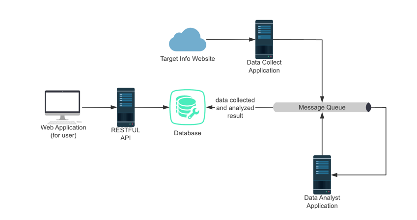

# Weather Data Collection and Analysis System

## Project Overview

This project is a weather data collection and analysis system designed to periodically collect weather data, analyze it,
and provide data visualization through a web application.

## Problems Addressed

The system aims to solve the problem of automated weather data collection and analysis. By periodically fetching weather
data from public sources, storing and analyzing the data, users can easily view historical and current weather
conditions.

## Target Audience

- Data scientists and analysts
- Weather enthusiasts
- Industry professionals needing weather data for decision-making, such as agriculture and logistics

## Unique Features

- Automated data collection and analysis
- Uses lightweight components (e.g., SQLite and RabbitMQ)
- Provides a RESTful API for easy data access and integration
- Static web application for simple and intuitive data visualization

## Architecture Diagram



## Main Components

1. **Data Collection Application**
    - Periodically fetches data from the weather API and stores it in the SQLite database.
    - Uses APScheduler to schedule tasks.

2. **RESTful API**
    - Provides an API for the frontend to query weather data.

3. **Data Analysis Application**
    - Analyzes the data stored in SQLite.
    - Uses RabbitMQ to trigger analysis tasks.

4. **Message Queue**
    - Uses RabbitMQ to coordinate data collection and analysis tasks.

5. **Web Application**
    - Static frontend that displays data fetched from the RESTful API.

## How to Run

### Prerequisites

- Python 3.11
- SQLite
- RabbitMQ
- Docker and Docker Compose

### Run project

```bash
# Python requirements
pip install -r requirements.txt

# Start RabbitMQ
docker-compose up -d

# Initialize Database && Start Application
python backend/weather_collector.py
python backend/weather_analyzer.py

# Start RESTful API
python backend/app.py
```

### view http://127.0.0.1:5000 at browser
